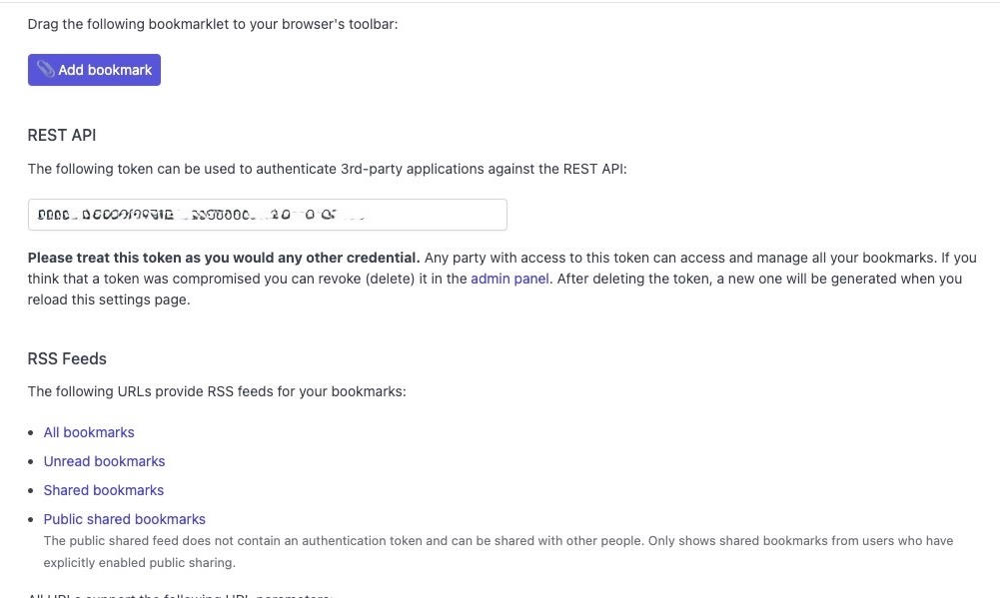

# Booksmarks to Linkding

This will allow you to import your bookmarks into the linkding platform. LindDing does not support folder structure, so this script will convert the folder structure to tags. 

## How to use

Step 1: Get your bookmarks in JSON format

**Firefox**

Backup bookmarks from the Bookmarks manager. If unsure, see [this](https://support.mozilla.org/en-US/kb/restore-bookmarks-from-backup-or-move-them#w_manual-backup)

**Chrome**

By default, Chrome stores your bookmarks as JSON, for example at:

For Windows users:

    C:\Users\user\AppData\Local\Google\Chrome\User Data\Default\Bookmarks

For Linux users:

    ~/.config/chrome/Default/Bookmarks

(The location of this file will vary depending on your platform of course.)

For Mac users:

    ~/Library/Application Support/Google/Chrome/Default/Bookmarks

Then, save the file as `bookmarks.json`

Step 2: Clone the project folder, create a virtualenv, activate it and install the requirements.

```bash
git clone
python3 -m venv .venv
source .venb/bin/activate
pip install -r requirements.txt
```

Step 2: Save the bookmarks file as `bookmarks.json` in the project folder.

Step 3: Add your linkding credentials

Get your rest api key, from your settings page.



```bash
export LINKDING_API_URL="http://your-linkding-instance/api/bookmarks/"
export LINKDING_API_TOKEN="your-api-token"
```

Step 4: Run the script

For chrome:

    python main.py --file bookmarks.json --format chrome

For chrome:

    python main.py --file bookmarks.json --format firefox

That's it. Failed import will be saved in `failed_import.json`, so review them after finish.
